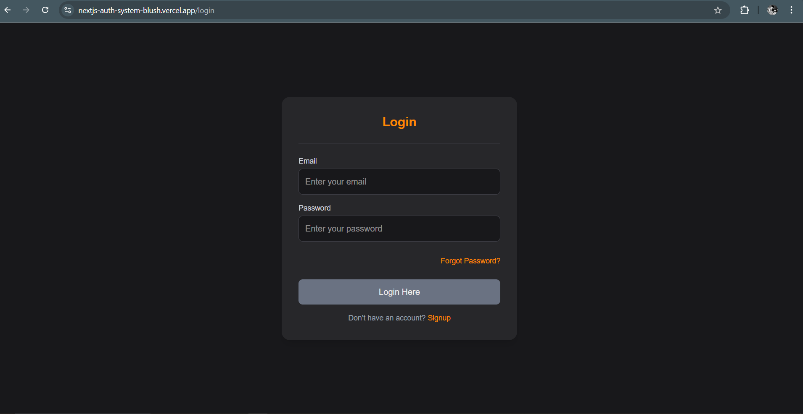
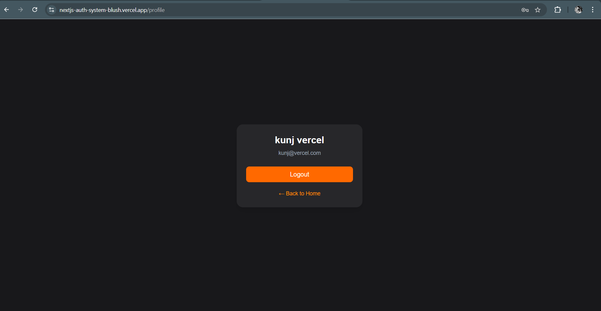
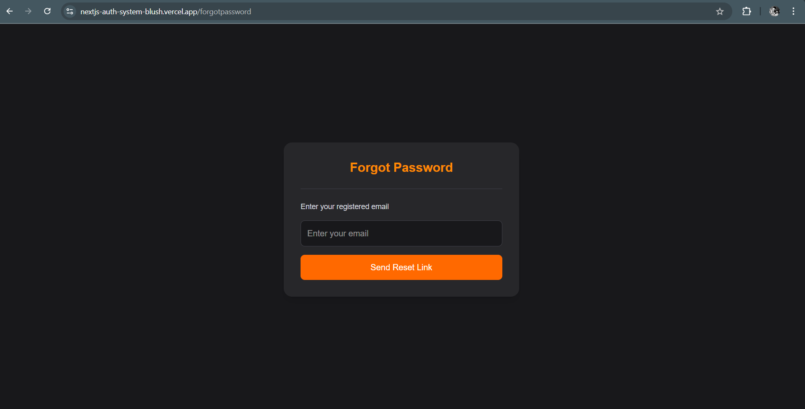

# 🔐 Next.js Authentication System

A **full-featured authentication system** built with **Next.js**, **MongoDB**, **JWT**, and **Nodemailer** — supporting **user signup, login, email verification, password reset**, and **protected routes**.

## Live Demo
**[Visit the Live App](https://nextjs-auth-system-blush.vercel.app)**  

---
 ## 🖼 Screenshots

### Login Page


### Signup Page


### Profile Page


### Reset Password Page



## Features

✅ **User Signup** — With validation for username, email, and password.  
✅ **User Login** — Secure login with JWT cookies.  
✅ **Email Verification** — Email sent using Mailtrap before activating the account.  
✅ **Forgot & Reset Password** — Sends secure token link for password reset.  
✅ **Protected Profile Route** — Only accessible after authentication.  
✅ **Modern UI** — Dark mode interface built with Tailwind CSS.  

---

## Tech Stack

| Technology | Purpose |
|-------------|----------|
| **Next.js (App Router)** | Frontend + Backend Routes |
| **MongoDB + Mongoose** | Database & Models |
| **JWT (jsonwebtoken)** | Secure Authentication |
| **bcryptjs** | Password Hashing |
| **Nodemailer + Mailtrap** | Email Verification & Reset |
| **Tailwind CSS** | Modern Dark UI |
| **React Hot Toast** | Alert Notifications |

---

```
## Folder Structure
src
├── 📁 app/
│ ├── 📁 api/
│ │ ├── users/
│ │ │ ├── signup/route.ts
│ │ │ ├── login/route.ts
│ │ │ ├── logout/route.ts
│ │ │ ├── me/route.ts
│ │ │ ├── verifyemail/route.ts
│ │ │ ├── forgotpassword/route.ts
│ │ │ └── resetpassword/route.ts
│ ├── 📁 profile/page.tsx
│ ├── 📁 login/page.tsx
│ ├── 📁 signup/page.tsx
│ ├── 📁 forgotpassword/page.tsx
│ └── 📁 resetpassword/page.tsx
│ └── 📁 verifyemail/page.tsx
├── 📁 models/
│ └── userModel.ts
├── 📁 dbConfig/
│ └── dbConfig.ts
├── 📁 helpers/
│ └── mailer.ts
│ └── getDataFromToken.ts
├── .env
└── README.md
```

---

##  How It Works

###  Signup
1. User enters username, email, password.
2. Frontend validates input (min length, regex for email).
3. Sends data to `/api/users/signup`.
4. Backend hashes password, stores user, sends verification email.

###  Email Verification
- Email contains link like:  
  `https://nextjs-auth-system-blush.vercel.app/verifyemail?token=<hashedToken>`
- Token is stored in DB and compared on GET request.
- On success → `isVerified = true`.

###  Login
- User enters credentials.
- Backend verifies user + password with bcrypt.
- JWT is signed and stored in a secure cookie.
- Protected pages decode this token to identify the user.

###  Forgot & Reset Password
1. User clicks “Forgot Password?” link.
2. Enters email → gets a reset link via Mailtrap.
3. Link looks like:  
   `https://nextjs-auth-system-blush.vercel.app/verifyemail?token=<hashedToken>>`
4. User sets new password → backend verifies token, hashes password, clears token.

---

##  Environment Variables (`.env`)

```bash
MONGODB_URI=your_mongo_connection_string
TOKEN_SECRET=your_jwt_secret
DOMAIN=https://your-vercel-link.vercel.app
MAIL_TRAP_USER=your_mailtrap_username
MAIL_TRAP_PASSWORD=your_mailtrap_password
```

---


## Clone the repo
```
git clone https://github.com/kunj-pandya/nextjs-authentication-system.git
```

## Install dependencies
```
npm install
```

## Run development server
```
npm run dev
```

App runs on http://localhost:3000

---


##  About the Author

**Kunj Pandya** – 
- GitHub: [kunj-pandya](https://github.com/kunj-pandya)  


## 📄 License
This project is licensed under the MIT License.
